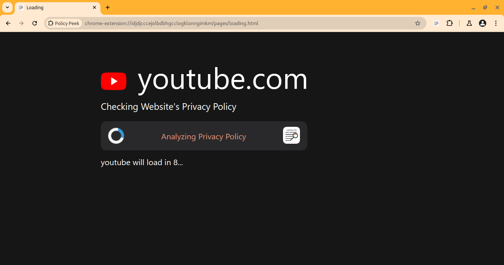
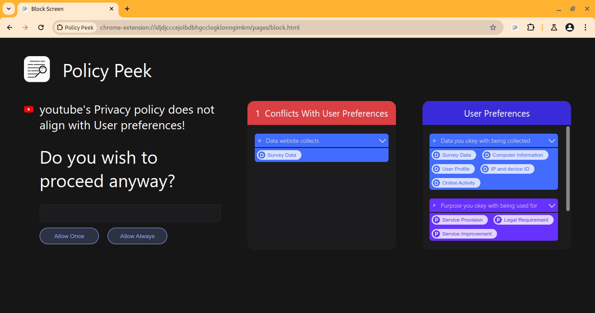
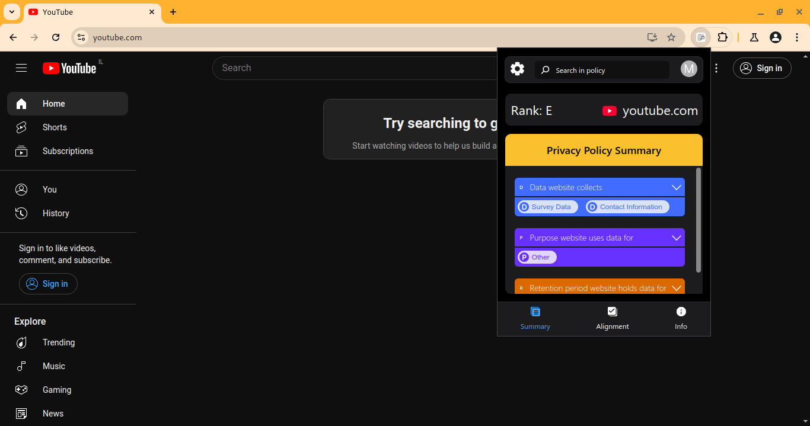
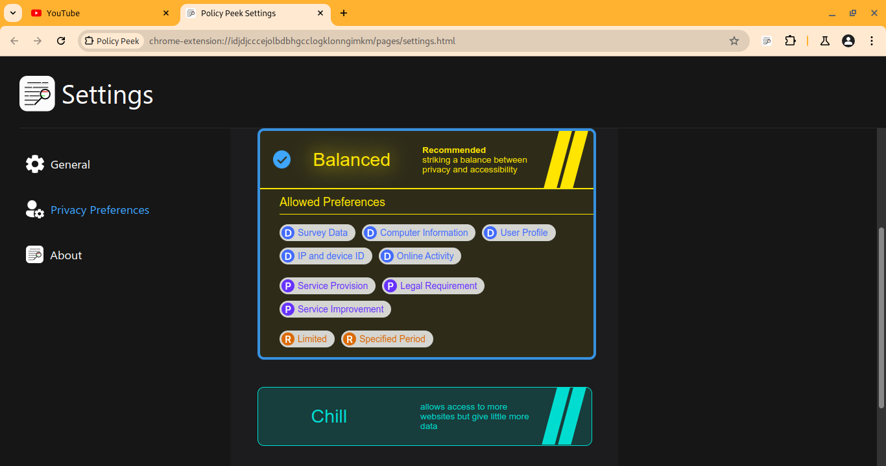

# Policy Peek chrome extension

A chrome extesion that gives back control and helps users make informed dicisions when agreeing to privacy policies of Websites.

## How it works

when a user visits a url in their browser, Policy Peek intercepts the request to prevent any user data to be handed to website's owners

if if the privacy policy of the visited website does not aign with user preferences, the user will be inform

at any time, the user can check the summary of the website's privacy policy and its alignment with their preferences

users can pick their own preferences from the settings page

> [!NOTE]  
> This Extension is not ready yet for user usage
